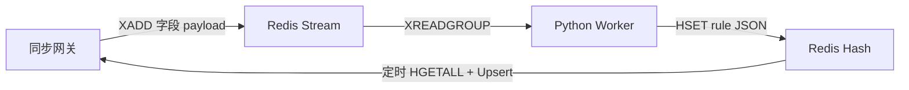

# Decoupled-LLM-Gateway

**当前版本**：**M1 + M2 + M3** —— 同步网关 + 混淆引擎 + **Redis 异步闭环**（日志流 → Worker 裁判 → 策略 Hash → 网关周期刷新）。  
目标仍是 **边界清楚、数据结构克制、热路径保持愚蠢（dumb）**；重判断只在 Worker 内完成，不阻塞请求路径。

---

## Milestone 1 交付范围

| 交付项 | 状态 |
|--------|------|
| Go 同步网关，OpenAI 兼容入口 `POST /v1/chat/completions` | ✅ |
| 不接真实 LLM：`echo-llm` 模拟上游 | ✅ |
| 系统侧诱饵注入 | ✅ |
| 进程内策略缓存 + 命中则模板降级（不调上游） | ✅ |
| 网关 → 异步环：每请求一行 NDJSON（`GatewayLogEvent`） | ✅ |
| Python Worker 桩（stdin 消费日志） | ✅ |
| 单元/集成测试 + GitHub Actions | ✅ |

**M1 验收口径**：`Request → [策略快照匹配] → [上下文混淆 + 诱饵] → [Mock LLM] → Response` 全链路可复现；`make test` 通过；可选策略种子下第二次同类请求可走降级路径（与 M3 闭环演示衔接）。

---

## Milestone 2：上下文混淆引擎

| 交付项 | 状态 |
|--------|------|
| 管道式 `Engine` + `Rule`（预编译正则，无锁并发安全） | ✅ |
| 默认规则集 `DefaultRules()`，进程级 `Prompt()` 与网关热路径对接 | ✅ |
| 表驱动单测 + `BenchmarkPromptShort` / `BenchmarkPromptLong` | ✅ |

**设计要点**

- **顺序敏感**：先匹配「形状明确」的令牌（JWT、`Bearer`、`sk-…`、云厂商 key 等），再做 UUID / ULID / ObjectId / IPv4 / 邮箱，最后做泛化 `…_id` / `… id` 键值，减少误伤与截断错误。
- **统一占位符**：一律替换为 `[ID_REMOVED]`，便于策略正则与审计字段稳定。
- **URL 查询串**：保留 `?` / `&` 与参数名，仅替换值，例如 `?token=secret` → `?token=[ID_REMOVED]`。

**默认规则一览**（实现见 `internal/obfuscate/obfuscate.go`）

| 顺序 | 名称 | 说明 |
|------|------|------|
| 1 | `jwt` | 三段式 JWT 外形 |
| 2 | `bearer` | `Bearer …` 头值 |
| 3 | `api_sk` | `sk-` 前缀 API key（常见厂商形态） |
| 4 | `github_pat` | `ghp_…` / `github_pat_…` |
| 5 | `slack_token` | `xoxb-` 等 Slack token |
| 6 | `aws_access_key` | `AKIA` + 16 位 |
| 7 | `google_api_key` | `AIza` 前缀 |
| 8 | `url_secrets` | 常见敏感 query 参数值 |
| 9–11 | `uuid_*` | 花括号、标准、32 位无连字符 |
| 12 | `ulid` | 26 位 Crockford Base32 |
| 13 | `mongo_objectid` | 24 位十六进制 |
| 14 | `ipv4` | 点分 IPv4 |
| 15 | `email` | 邮箱地址 |
| 16 | `id_kv` | `user_id` / `user id:` 等扩展键名 |

**M2 验收口径**：`go test ./internal/obfuscate/ -count=1` 全绿；`go test -bench=. -benchmem ./internal/obfuscate/` 可本地观察吞吐（不作为 CI 硬门槛）。

### M3 前：混淆档位（Profile）与自定义规则

贴近当前工程里常见的 **「默认强脱敏 vs 低误伤」** 折中（类似日志管线里的 sampling / 字段分级），网关支持：

| `GATEWAY_OBFUSCATE_PROFILE` | 行为 |
|-----------------------------|------|
| `strict`（默认）或 `full` | 与 `DefaultRules()` 完全一致，脱敏最强。 |
| `minimal` | 仅 UUID（花括号 / 标准 / 32 位紧凑）+ `id_kv`，**不**剥 IPv4、邮箱、JWT 等，适合文档/代码片段多的场景。 |
| `balanced` | 在 full 基础上去掉 `ipv4` 与 `email` 两条规则：仍剥 JWT、密钥、UUID 等，**保留**内网 IP 与邮箱字面量（减少教程/配置类误伤）。 |

**追加规则文件** `GATEWAY_OBFUSCATE_RULES_FILE`：指向 JSON **数组**，在 profile 规则 **之后** 再执行（适合组织内部工单号、员工编号等）。每项：

```json
{
  "name": "optional_rule_name",
  "pattern": "Go regexp（RE2）",
  "repl": "省略则使用 [ID_REMOVED]"
}
```

示例：`examples/obfuscate_extra_rules.json`。

启动示例：

```bash
GATEWAY_OBFUSCATE_PROFILE=balanced \
GATEWAY_OBFUSCATE_RULES_FILE=examples/obfuscate_extra_rules.json \
go run ./cmd/gateway
```

**实现入口**：`internal/obfuscate/profiles.go`、`loader.go`；`internal/gateway` 的 `New` 在进程启动时调用 `obfuscate.NewConfiguredEngine`。`Handler.Obfuscate` 为 nil 时回退到包级 `obfuscate.Prompt`（便于单测）。

---

## 设计哲学（与「同步 / 异步解耦」一致）

1. **极简关键路径（Keep the Hot Path Dumb）**  
   同步网关只做轻量字符串处理、JSON 中 `messages` 的改写与 HTTP 转发，**不在返回前等待**任何重推理或外部裁判。

2. **异步容错（Fail Async）**  
   复杂判定在 **Python Worker** 中执行（M3：Redis Streams 消费 + 简易「混合裁判」占位逻辑）；网关只追加日志与合并策略，不在请求路径上等待 Worker。

3. **优雅降级优先（Degrade Gracefully）**  
   命中本地策略（或后续扩展的硬熔断）时，**立即**返回预设模板响应，避免上游挂起拖死业务。

---

## 系统架构：上半部与下半部

### 上半部：同步网关（低延迟）

- **实现**：`cmd/gateway`，核心逻辑在 `internal/gateway`。
- **职责（M1）**  
  - **上下文混淆**：`internal/obfuscate` 管道引擎（M2 规则集，见下文）。  
  - **诱饵注入**：在系统消息中注入可追踪 token（`internal/decoy` + `internal/chat`）。  
  - **拦截与降级**：读取进程内策略（`internal/policy`）；匹配则返回模板 JSON，否则转发上游。  
- **延迟预期**：同步侧仅为正则/JSON 与一次 HTTP 客户端调用；不设重计算（具体数值依赖机器与网络，设计目标与论文中「毫秒级附加」一致，由后续基准补充）。

### 下半部：异步治理环（M3）

- **实现**：`worker/main.py` + Redis。  
- **数据路径**：网关 `XADD` → Stream（字段 `payload` = `GatewayLogEvent` JSON）→ Worker `XREADGROUP` → 判定 → `HSET` 策略 Hash → 网关后台 `HGETALL` 周期刷新内存 `Store`。  
- **无 Redis 时**：Worker 仍可从 **stdin** 读 NDJSON（与 M1 兼容），但不会自动回写网关；适合本地管道调试。

---

## 核心数据契约（API 边界）

网关与异步环 **只通过约定字段通信**，避免隐式耦合。

### 1. 网关 → 异步环（日志推流）

每处理完一次请求，写入配置的 Sink（**可多路**）：

- 未配置 `GATEWAY_REDIS_ADDR`：默认 **stdout** 一行 JSON（NDJSON）。  
- 配置 Redis：**Redis Stream** 一条消息，`payload` 为与下述相同结构的 JSON；若 `GATEWAY_ASYNC_LOG=1`，可同时写 **stdout**（`logsink.Multi`）。

事件结构：

```json
{
  "trace_id": "req-1a2b3c",
  "timestamp": 1710892800,
  "injected_decoy_id": "decoy-xxxxxxxx",
  "raw_user_prompt": "原始用户侧拼接快照",
  "obfuscated_prompt": "混淆后的用户侧快照",
  "llm_response": "上游返回摘要或全文片段",
  "degradation_triggered": false
}
```

### 2. 异步环 → 网关（策略缓存：文件种子 / Redis Hash / 内存）

```json
{
  "rule_id": "rule-malicious-compliance-01",
  "action": "DEGRADE_TO_TEMPLATE",
  "trigger_pattern": "Go 正则表达式，匹配 obfuscated_prompt",
  "template_response": "抱歉，该请求违反安全策略，已被拒绝。"
}
```

启动时可通过 `GATEWAY_POLICY_SEED_FILE` 加载 JSON **数组**；M3 下 Worker 将规则 **`HSET`** 到 Redis Hash（默认 `decoupled:policy:rules`，field = `rule_id`，value = 上列 JSON 字符串），网关在热路径外按间隔 **全量合并** 到内存 `Store`（`Upsert`）。

---

## Milestone 3：闭环防御验证（Async Feedback）

### 架构与数据流

设计要点：**网关只写流** → **Worker 异步裁判** → **Redis Hash 回灌** → **网关周期刷新**；不在请求路径上等待 Worker。



- **热路径**：仍为「策略匹配 → 混淆 → 诱饵 → 上游」；启用 Redis 时额外增加一次 **`XADD`**（短超时、非阻塞语义），不等待消费方。  
- **策略内存模型**：`MemoryStore` 启动时仍可 `LoadFromFile` 种子规则；Redis 中的条目通过 **`Upsert`** 覆盖或追加同一 `rule_id`。

### 交付项一览

| 交付项 | 说明 |
|--------|------|
| Redis Stream 日志 | `internal/logsink/redis_stream.go`，字段 **`payload`** = `GatewayLogEvent` JSON。 |
| 多路日志 | `internal/logsink/multi.go`：`stdout` + Stream 可同时启用（`GATEWAY_ASYNC_LOG=1`）。 |
| 策略刷新 | `internal/policy/redis_refresh.go`：`StartRedisRefresher` 定时 `HGETALL` → `Upsert`。 |
| 单测 | `internal/policy/redis_refresh_test.go`（miniredis，验证刷新后 `MatchPrompt`）。 |
| Python Worker | `worker/main.py`：消费组；无 Redis 时 stdin NDJSON 回退（不写回网关）。 |
| 演示 Echo | `ECHO_LEAK_SYSTEM=1`：echo 将 **system** 拼入回复，模拟诱饵被「抽出」。 |
| 编排 | `docker-compose.yml`、`make redis-up`、`scripts/m3_demo.sh`。 |

### M3 相关代码与依赖（速查）

| 路径 / 依赖 | 作用 |
|-------------|------|
| `go.mod` / `go.sum` | `github.com/redis/go-redis/v9`、`github.com/alicebob/miniredis/v2`（测试刷新） |
| `cmd/gateway/main.go` | `PING` Redis、装配 Sink、`StartRedisRefresher` |
| `internal/logsink/redis_stream.go` | Stream 写入 |
| `internal/logsink/multi.go` | 多 Sink |
| `internal/policy/redis_refresh.go` | Hash → 内存策略 |
| `worker/main.py` | 异步环主程序 |
| `worker/requirements.txt` | `redis>=5,<6` |

### Worker 裁判逻辑（MVP，可替换为真混合裁判）

实现位置：`worker/main.py` 中 `judge()`。

1. 若 `degradation_triggered == true`：不再下发规则（已降级过）。  
2. **诱饵泄露**：若 `injected_decoy_id` 非空且该字符串出现在 `llm_response` 中，视为模型输出泄漏了诱饵。  
3. **生成规则**：固定 `rule_id = m3-decoy-leak`；`trigger_pattern` 为 **`obfuscated_prompt` 前 120 字符** 经 `re.escape` 后的字面量正则（与网关侧「用户侧快照」一致）。  
4. **写入 Redis**：`HSET <policy_hash> <rule_id> <PolicyRule JSON>`；网关下一轮刷新时 `Upsert` 进内存。  
5. **扩展**：可在同一函数内串联 Llama Guard、多模型投票等，**无需修改**网关 `GatewayLogEvent` / `PolicyRule` 字段即可迭代。

### 闭环验收（手工）

1. `docker compose up -d redis`（或 `make redis-up`）  
2. `ECHO_LEAK_SYSTEM=1 make run-echo`  
3. `export GATEWAY_REDIS_ADDR=127.0.0.1:6379`；建议 **`GATEWAY_ASYNC_LOG=0`**，仅走 Stream，避免与 stdout 重复分析；`make run-gateway`  
4. `pip install -r worker/requirements.txt`；`export WORKER_REDIS_URL=redis://127.0.0.1:6379/0`；`python3 worker/main.py`  
5. 第一次 `curl`：用户句诱导复述系统内容（echo 泄漏后响应中含 `decoy-`）→ Worker 写规则。  
6. 等待 `GATEWAY_POLICY_REFRESH_MS`（默认 2000ms）后，**相同用户句** 再请求 → 应在进入模型前 **降级**（模板 JSON）。

**说明**：`obfuscated_prompt` 仅由 **用户** 角色消息拼接，**不含** system；规则按用户文本前缀匹配，故同一用户句重复攻击会命中。若需 **HDEL 同步剔除内存规则**、**Pub/Sub 即时刷新** 或 NATS，可作为后续迭代（见路线图）。

### M3 环境变量摘要

| 场景 | 变量 |
|------|------|
| 网关写 Stream + 拉策略 | `GATEWAY_REDIS_ADDR`（必填）、`GATEWAY_REDIS_STREAM`、`GATEWAY_POLICY_REDIS_HASH`、`GATEWAY_POLICY_REFRESH_MS` |
| 仅 Stream、不重复 NDJSON | `GATEWAY_ASYNC_LOG=0` |
| Echo 演示泄漏 | `ECHO_LEAK_SYSTEM=1` |
| Worker | `WORKER_REDIS_URL`、`WORKER_STREAM`、`WORKER_GROUP`、`WORKER_CONSUMER`、`WORKER_POLICY_HASH`（默认与网关一致） |

（完整默认值见下文「环境变量」大表。）

---

## 论文实验数据（Track A 协议）

与《Beyond Model Reflection / 解耦安全》**§5 评估协议**对齐的**可脚本化**基准，输出 JSON（便于再跑随机种子、算置信区间或导入分析笔记本）。

| 论文防御基线 | 本仓库实现方式 |
|--------------|----------------|
| 统一架构（混淆 + 诱饵 + 策略） | 默认网关，不设 `X-Gateway-Experiment-Mode` |
| 无上下文混淆 | `X-Gateway-Experiment-Mode: no_obfuscate` |
| 无诱饵注入 | `no_decoy` |
| 仅意图类（无 ID 对齐、无诱饵） | `intent_only` |
| 单 guard（无网关栈） | 直连 `echo-llm`：`--defenses direct_upstream`；配合 `X-Echo-Refuse-Substr` 模拟关键词拒绝 |
| SmoothLLM 式输入扰动 | `smooth_llm`：客户端对用户文本做轻量空白抖动 |

**上游 echo 评测开关**（亦可通过网关转发的 HTTP 头传递，便于 A/B 对照）：

| 变量 / 头 | 作用 |
|-----------|------|
| `ECHO_REFUSE_SUBSTR` / `X-Echo-Refuse-Substr` | 用户消息含该子串则返回 `REFUSAL_SINGLE_GUARD`（模拟单裁判拒绝） |
| `ECHO_EVAL_SECRET` / `X-Echo-Eval-Secret` | 与泄漏联用：在「系统块」中附加 `EVAL_SECRET=…` 供抽取 F1 / ASR 计量 |
| `ECHO_LEAK_SYSTEM` / `X-Echo-Leak-System: 1` | 将 system（含诱饵/秘密）拼进助手回复，模拟泄露 |

**网关环境变量**：`GATEWAY_EXPERIMENT_MODE` 取 `default` \| `no_obfuscate` \| `no_decoy` \| `intent_only`；每条请求可用 `X-Gateway-Experiment-Mode` **覆盖**（实验台专用，生产入口应剥离该头）。

**跑分**（需已启动 `echo-llm` 与 `gateway`）：

```bash
# 建议关闭网关 NDJSON  stdout，避免与脚本输出混在一起：GATEWAY_ASYNC_LOG=0
GATEWAY_ASYNC_LOG=0 GATEWAY_UPSTREAM=http://127.0.0.1:9090 go run ./cmd/gateway
```

```bash
python3 experiments/run_paper_benchmark.py \
  --gateway-url http://127.0.0.1:8080 \
  --upstream-url http://127.0.0.1:9090 \
  -o /tmp/paper_eval.json
```

指标字段：`rsr`（拒绝成功）、`asr_extraction`（秘密是否泄露）、`extraction_f1`（抽取 token-F1）、`latency_ms`。**Track B**（GCG 等梯度攻击）不在此脚本内，需在离线训练环境中单独上报。

本地自检（无网络）：`make paper-eval-check`。

---

## 仓库布局

| 路径 | 说明 |
|------|------|
| `cmd/gateway` | 同步网关入口 |
| `cmd/echo-llm` | Mock LLM（回声 OpenAI 形响应） |
| `internal/contracts` | 上述 JSON 的 Go 结构体 |
| `internal/chat` | 仅改写 `messages`，保留其余请求字段 |
| `internal/obfuscate` | M2 上下文混淆引擎（`Engine` / `DefaultRules` / `Prompt`） |
| `internal/decoy` | 诱饵 ID 生成与注入 |
| `internal/policy` | `Store` 接口与内存实现 |
| `internal/gateway` | HTTP 热路径编排 |
| `internal/logsink` | NDJSON / Redis Stream / `Multi` |
| `internal/policy/redis_refresh.go` | M3：从 Redis Hash 刷新策略 |
| `worker/main.py` | M3：Redis 消费组 + stdin 回退 |
| `worker/requirements.txt` | Python 依赖（redis-py） |
| `experiments/run_paper_benchmark.py` | 论文 §5 对齐的 JSON 基准（Track A） |
| `docker-compose.yml` | 本地 Redis |
| `scripts/m3_demo.sh` | M3 演示步骤提示 |
| `examples/policy_seed.json` | 演示用策略种子 |
| `examples/obfuscate_extra_rules.json` | 演示用追加混淆规则 |

---

## 快速开始

**终端 1 — Mock LLM**

```bash
cd Decoupled-LLM-Gateway
make run-echo
```

**终端 2 — 网关**（默认上游 `http://127.0.0.1:9090`）

```bash
cd Decoupled-LLM-Gateway
make run-gateway
```

**一键脚本**（后台起 echo，前台起 gateway）

```bash
bash scripts/dev.sh
```

**调用示例**（`temperature` 等字段会原样转发，仅 `messages` 被网关处理）

```bash
curl -sS http://127.0.0.1:8080/v1/chat/completions \
  -H 'Content-Type: application/json' \
  -d '{"model":"mock","temperature":0.7,"messages":[{"role":"user","content":"hello"}]}'
```

**无 Redis：将 NDJSON 管道给 Worker（仅解析/打印规则，不写回网关）**

```bash
make run-gateway 2>/dev/null | python3 worker/main.py
```

**M3：使用 Redis 时** 由网关直接向 Stream 写事件，Worker 使用 `WORKER_REDIS_URL` 独立进程运行（见上文 Milestone 3）。

---

## 环境变量

| 变量 | 默认 | 含义 |
|------|------|------|
| `GATEWAY_LISTEN` | `:8080` | 网关监听地址 |
| `GATEWAY_UPSTREAM` | `http://127.0.0.1:9090` | 上游 OpenAI 兼容 API 根 URL |
| `GATEWAY_UPSTREAM_TIMEOUT_MS` | `30000` | 上游 HTTP 超时 |
| `GATEWAY_MAX_BODY_BYTES` | `4194304` | 请求/响应体大小上限 |
| `GATEWAY_ASYNC_LOG` | `1` | `0` 关闭 NDJSON 事件输出 |
| `GATEWAY_POLICY_SEED_FILE` | 空 | 启动时加载策略 JSON 数组 |
| `GATEWAY_OBFUSCATE_PROFILE` | `strict` | `strict` / `full` / `minimal` / `balanced` |
| `GATEWAY_OBFUSCATE_RULES_FILE` | 空 | 在 profile 之后追加执行的规则 JSON 数组 |
| `GATEWAY_REDIS_ADDR` | 空 | 非空则启用 Redis：`XADD` 日志 + 周期拉取策略 Hash |
| `GATEWAY_REDIS_STREAM` | `decoupled:gateway:events` | Stream 名称 |
| `GATEWAY_POLICY_REDIS_HASH` | `decoupled:policy:rules` | 策略规则 Redis Hash |
| `GATEWAY_POLICY_REFRESH_MS` | `2000` | 从 Redis 刷新策略的周期（毫秒） |
| `GATEWAY_EXPERIMENT_MODE` | `default` | `no_obfuscate` / `no_decoy` / `intent_only`（可被请求头覆盖） |
| `ECHO_LISTEN` | `:9090` | 回声服务监听地址 |
| `ECHO_LEAK_SYSTEM` | `0` | `1` 时在回复中附加 system 内容（M3 诱饵泄露演示） |
| `ECHO_EVAL_SECRET` | 空 | 评测用秘密串（亦可用 `X-Echo-Eval-Secret`） |
| `ECHO_REFUSE_SUBSTR` | 空 | 用户句含该子串则拒绝（亦可用 `X-Echo-Refuse-Substr`） |

**Worker 环境变量（Redis 模式）**：`WORKER_REDIS_URL`（如 `redis://127.0.0.1:6379/0`）、`WORKER_STREAM`、`WORKER_GROUP`、`WORKER_CONSUMER`、`WORKER_POLICY_HASH`（默认值与网关侧一致）。

---

## 策略种子与防御性降级

演示文件：`examples/policy_seed.json`。

```bash
GATEWAY_POLICY_SEED_FILE=examples/policy_seed.json go run ./cmd/gateway
```

当 **混淆后的用户侧快照** `obfuscated_prompt` 对应的拼接文本匹配某条规则的 `trigger_pattern`，且 `action` 为 `DEGRADE_TO_TEMPLATE` 时，网关 **不调用上游**，直接返回 OpenAI 形的完成 JSON，正文为 `template_response`。

---

## 开发与 CI

```bash
# 首次克隆或改动 go.mod 后建议执行，以拉齐依赖与校验和：
go mod tidy
go test ./... -race -count=1
go vet ./...
```

或使用：

```bash
make test    # go test ./... -race -count=1
make vet     # go vet ./...
```

**依赖说明**：M3 引入 `github.com/redis/go-redis/v9`；测试使用 `github.com/alicebob/miniredis/v2` 模拟 Redis，无需本机起容器即可跑 `internal/policy` 刷新用例。若本地 `go test` 因代理/网络无法下载模块，可配置 `GOPROXY`（如 `https://goproxy.cn,direct`）后重试；**仓库中的 `go.sum` 应提交**，以便 CI 校验模块完整性。

仓库根目录下 GitHub Actions：`.github/workflows/decoupled-llm-gateway.yml`（变更 `Decoupled-LLM-Gateway/**` 时触发 Go 测试/vet、`pip install worker` 与 Worker CLI 检查、stdin 冒烟）。

---

## 路线图

| 里程碑 | 内容 |
|--------|------|
| **M1** | 骨架 + Echo + 诱饵/策略降级 + NDJSON + Worker 桩 + CI |
| **M2** | 上下文混淆引擎 + profile / 外部 JSON 追加规则 |
| **M3（当前）** | Redis Streams + Worker 裁判占位 + Hash 策略下发 + 网关周期刷新，完成「诱饵泄露 → 规则 → 二次请求前置降级」闭环 |
| **后续** | 真混合裁判（多模型/本地 SLM）、NATS、规则版本与删除语义 |

---

## 许可

与父仓库一致；若单独拆库，请在本目录补充 `LICENSE` 并视情况修改 `go.mod` 的 `module` 路径。
