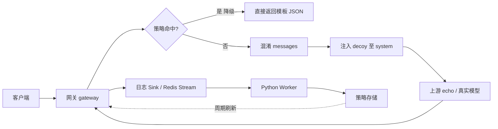

# 项目逻辑说明（初学者指南）

本文面向对 **LLM API 安全 / 网关架构** 不熟悉的读者，说明本仓库**由哪些部分组成**、**一次请求如何被处理**，以及 **论文中的「Dataset Mutator」与现有代码的关系**。

---

## 1. 文档目的与阅读对象

- **目的**：把仓库内「论文叙事」与「可运行代码」对应起来，建立从 `curl` 到内部模块的心智模型。
- **对象**：能使用终端与 HTTP 请求，但尚未熟悉 OpenAI 兼容 API、网关分层与异步治理的读者。
- **范围**：以仓库当前内容为准；实现细节以 `Decoupled-LLM-Gateway/README.md` 与源码为准。

---

## 2. 仓库由哪两部分构成

| 部分 | 路径（示例） | 内容性质 |
|------|----------------|----------|
| **理念与论文材料** | `paper/` 等 | 安全评测数据保护、**受控变异（Dataset Mutator）**、架构与威胁模型等**设计与论述**。 |
| **可运行工程** | `Decoupled-LLM-Gateway/` | **解耦 LLM 网关**演示：OpenAI 形状入口、上下文混淆、诱饵、策略、日志与（可选）Redis + Python Worker 异步闭环。 |

**一句话**：论文侧重「数据与评测管线如何设计」；当前 **Go/Python 代码主要落地「在线 API 网关」**，用于演示请求路径上的治理与取证，而非完整离线数据集语言学变异流水线。

---

## 3. 入门所需的三个背景概念

### 3.1 应用如何调用大模型

常见形态为 **HTTP POST**，JSON 体中包含 **`messages`** 数组（多轮对话中的 user / system / assistant 等角色），路径常为 **`/v1/chat/completions`**（OpenAI 兼容约定）。本仓库中的 **gateway** 与 **echo-llm** 均遵循该形状，便于现有客户端少改即用。

### 3.2 为什么要在中间加「网关」

用户提示中可能包含 **密钥、Token、内网 IP、邮箱** 等敏感字面量。若不经处理直接转发给模型或第三方，存在 **泄露与合规** 风险。网关在 **转发前** 可统一完成脱敏、策略命中、审计日志等，避免各业务重复实现且标准不一。

### 3.3 「同步」与「异步解耦」

| 类型 | 期望 | 本仓库中的体现 |
|------|------|----------------|
| **同步（热路径）** | 单次请求 **低延迟** 返回 | 只做 JSON 解析、字符串规则改写、HTTP 转发、进程内策略匹配等轻量逻辑。 |
| **异步** | **不阻塞** 当前请求 | 复杂判定放在 **Worker**（及 Redis Stream）中；网关 **追加日志**，策略由后台周期刷新进入内存（见 `Decoupled-LLM-Gateway/README.md` M3）。 |

设计原则可概括为：**热路径保持简单（dumb）**；重判断在异步环完成。

---

## 4. 一次请求在网关中的处理顺序

以下与 `internal/gateway` 中的流水线一致，可记为：

**策略 → 混淆 → 诱饵 → 上游（真实模型或 echo）→ 返回响应，并写入日志**

### 4.1 接收与校验

- 仅处理 **`POST /v1/chat/completions`**（其他路径如根路径 `/` 可能返回 404，属预期）。
- 读取请求体，并有 **最大体积限制**，防止异常大包影响服务。

### 4.2 用户侧快照（混淆前）

从原始 JSON 中抽取用于 **日志与策略输入** 的用户可见文本快照（**混淆之前**），便于审计「用户实际说了什么」。

### 4.3 上下文混淆（Obfuscation）

对 `messages` 中需脱敏的文本应用规则管道（如 JWT、`Bearer`、`sk-` 前缀密钥、UUID、邮箱等），统一替换为 **`[ID_REMOVED]`** 等占位，降低敏感字面进入上游的概率。

可通过环境变量选择 **档位**（如 `strict` / `balanced` / `minimal`）或 **自定义规则 JSON 文件**，在脱敏强度与误伤正常文本（如文档、教程）之间折中。详见 `Decoupled-LLM-Gateway/README.md` 中 M2 / Profile 小节。

### 4.4 策略（Policy）

使用 **混淆之后** 的用户提示快照进行匹配。若命中需 **降级** 的规则：网关 **直接** 构造 OpenAI 形状的 JSON 响应（模板内容），**不再调用上游**。用于快速拒绝某类输入、避免上游挂起拖死业务等场景。

### 4.5 诱饵（Decoy）

若仍需转发上游：在 **system** 消息中注入带随机 **`decoy-…`** 的标记，用于 **追踪该次请求注入物**；若上游或下游异常泄露该标记，可作为审计或演示「外泄」检测思路。演示用 **`echo-llm`** 在设置 `ECHO_LEAK_SYSTEM=1` 时可将 system 内容回显，便于联调。

### 4.6 转发上游

将改写后的 JSON 转发至 **`GATEWAY_UPSTREAM`** 配置的地址。本地联调时常为 **echo-llm**（不进行真实推理，仅按规则回显或拼接）。

### 4.7 日志（Log Sink）

每次处理发出结构化事件 **`GatewayLogEvent`**（字段包括 trace、原文快照、混淆后快照、注入的 decoy id、模型回复摘要、是否触发降级等）。M3 下可写入 **Redis Stream**，供 Python Worker 消费。

### 4.8 异步闭环（M3）

Worker 消费日志、执行（占位或未来的）裁判逻辑，将 **`PolicyRule`** 写回 Redis；网关进程 **周期性** 刷新内存策略存储，使策略可更新而 **无需** 在单次请求路径上等待 Worker。

---

## 5. 两个可执行服务分别做什么

| 服务 | 默认监听 | 角色 |
|------|-----------|------|
| **echo-llm** | `:9090` | **模拟上游**：OpenAI 兼容接口，**不**做真实推理；例如对用户最后一轮内容加 `[echo]` 前缀，用于打通全链路。健康检查可用 `GET /healthz`。 |
| **gateway** | `:8080`（以配置为准） | **演示核心逻辑**：混淆、诱饵、策略、转发上游、写日志（及可选 Redis）。 |

典型联调：先启动 echo，再启动 gateway（`GATEWAY_UPSTREAM` 指向 echo），对 **8080** 发 `POST /v1/chat/completions`，响应中的 `[echo] …` 表明请求已经网关加工并到达 echo。

**注意**：URL 路径应使用 **单斜杠**（如 `/v1/chat/completions`）；双斜杠 `//v1/...` 可能触发 HTTP 301 规范化重定向。根路径 `/` 未注册 handler 时返回 404 属正常。

---

## 6. 论文中的「Dataset Mutator」与当前代码的关系

| 概念 | 含义（简述） | 在本仓库中的位置 |
|------|----------------|------------------|
| **Dataset Mutator（数据集变异器）** | 对评测样本生成 **语义保持、表面不同** 的变体族；多轮评测轮换表面形式，增加「渐进式重构」难度，同时尽量保持评测标签与语义一致。 | 主要见于 **`paper/`** 等文档的论述与设计。 |
| **Decoupled LLM Gateway** | 在 **单次在线请求** 上做脱敏、诱饵、策略与审计，并与异步环解耦。 | 主要见于 **`Decoupled-LLM-Gateway/`** 源码与 README。 |

二者同属 **大模型安全与评测治理** 语境，但层级不同：**Mutator 偏数据与 benchmark 侧**；**网关偏在线 API 侧**。阅读论文时不必假定每一节都已在 `Decoupled-LLM-Gateway` 中逐项实现，以 README 里程碑（M1/M2/M3）为准。

---

## 7. 架构示意（数据流）



---

## 8. 进一步阅读与命令入口

- **网关里程碑、环境变量、Redis / Worker 启动**：`Decoupled-LLM-Gateway/README.md`
- **网关核心热路径**：`Decoupled-LLM-Gateway/internal/gateway/gateway.go`
- **消息改写与诱饵挂载**：`Decoupled-LLM-Gateway/internal/chat/chat.go`
- **日志与策略契约**：`Decoupled-LLM-Gateway/internal/contracts/contracts.go`

本地快速命令（需在 `Decoupled-LLM-Gateway` 目录下，且已满足 Go 环境与网络拉依赖条件）：

```bash
make run-echo      # 终端 1：启动 mock 上游 :9090
make run-gateway   # 终端 2：启动网关（需配置 GATEWAY_UPSTREAM 等，见 README）
```

---

## 9. 修订说明

- 本文随仓库结构整理，若目录或里程碑变更，请以 `Decoupled-LLM-Gateway/README.md` 与源码为准并同步更新本节相关描述。
