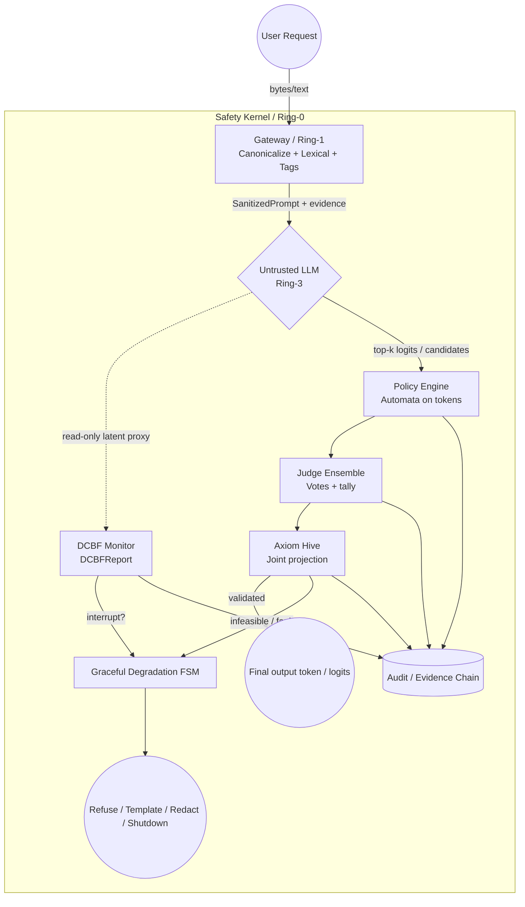

# RFC: Decoupled Safety Kernel Architecture (v0.1, revised)

> **后续版本：** 发布级整合稿见 **`Decoupled Safety Kernel Architecture RFC_v0.2.md`**（以本文为底稿，并按 `RFC_v0.2_review.md` 补强治理与完整性章节）。

**Author:** Anthropic Claude Code  
**Revised per:** `Decoupled Safety Kernel Architecture RFC_v0.1_review.md`  
**Target audience:** Kernel / systems architects  
**Status:** Draft — contract-first revision（技术主干已由 v0.2 继承并扩展）

---

## 0. 设计目标与原则（新增）

本 RFC 定义与基础模型**解耦**的 **Safety Kernel**：基础 LLM 视为 **Ring-3 非可信、随机、用户态生成进程**；Safety Kernel 为 **特权态外生约束系统**，负责：

- 输入规范化、净化与边界隔离  
- 隐状态轨迹的**离散时间**安全监测（DCBF）  
- 安全规则 DSL 的解析、降级与确定性自动机执行  
- 多验证器的**可审计**裁决（非单一布尔）  
- 在安全可行域上对 **候选集 / 对数概率 / 能量** 的联合投影与故障处理  
- 安全与活性冲突时进入 **Graceful Degradation 状态机**

**核心原则：**

> Safety is an **external invariant** and an **auditable contract**, not an emergent property of the base model.

**失败默认（必须写进实现）：**

| 条件                 | 默认动作                           |
| ------------------ | ------------------------------ |
| Verifier 冲突 / 证据不足 | **Deny**（拒绝或安全模板）              |
| 投影不可行 / QP 超时      | **PageFault 路径** → 降级 FSM      |
| 步级总预算耗尽            | **DeadlineExceeded** → 降级 FSM  |
| 审计记录写入失败（若策略要求）    | **Fail-safe**（由部署策略定义；建议 deny） |

---

## 1. 架构拓扑：分层 + 权责 + 证据链

### 1.1 Ring 与信任边界

| 环          | 组件                                                                            | 典型权限                         |
| ---------- | ----------------------------------------------------------------------------- | ---------------------------- |
| **Ring-3** | Untrusted LLM（自回归核）                                                           | 仅用户态缓冲；**无**策略写权限            |
| **Ring-1** | Gateway（规范化 / 词法 / 边界）                                                        | 读请求；输出规范化流 + **policy_tags** |
| **Ring-0** | DCBF Monitor、Policy Engine、Judge Ensemble、Axiom Hive、Graceful Degradation FSM | 可中断生成步；可写**审计与裁决**           |
| **横切**     | **Audit Log / Evidence Chain**（强制）                                            | 只追加；与每次 token 步绑定 `trace_id` |

### 1.2 职责细化（相对 v0.1 原稿）

- **Gateway**：不仅是 filter，还须区分 **canonicalization**、**lexical matching**、**boundary sanitization**、**policy tagging**（为下游 Verifier 提供可复用标签）。  
- **DCBF Monitor**：明确其输入为 **latent 的只读代理表示**（例如 side-head / probe 向量，而非完整黑盒权重）；near-violation 时可 **软收紧**（提高投影强度）或 **硬中断**（由 `DCBFReport.interrupt` 表达）。  
- **Judge Ensemble**：必须是 **多 Verifier + 投票/计票协议**，不能坍缩为单个 `bool`。  
- **Axiom Hive**：对 **candidate set / logits / latent 代理（若使用）/ DCBF 报告 / 截止时刻** 做联合决策，而非仅对孤立 `Token` 做“补救”。  
- **Graceful Degradation**：从 `-> !` 提升为 **显式状态机**（多种降级输出）。

### 1.3 架构图（Mermaid）



---

## 2. 约束三类分解（避免 latent/token 语义混杂）

1. **Lexical / structural（词法/结构）**  
   Gateway + DSL 编译产物（自动机）在 **token 序列**上判定前缀合法性。

2. **Latent trajectory（潜轨迹）**  
   DCBF 仅在**约定的只读代理表示**上检查离散时间屏障条件；**不**声称所有语法约束都可嵌入潜空间。

3. **Output legality / semantic contracts（输出合法性/语义契约）**  
   Judge Ensemble +（可选）外部确定性检查器；与 (1)(2) **正交**，结果必须进入证据链。

---

## 3. 核心接口（修订：厚契约 + 证据）

以下 Rust 风格接口为 **规范意图**；实现可拆分 crate，但**字段语义不得删减**。

### 3.1 Gateway

```rust
pub struct Finding {
    pub rule_id: String,
    pub span: std::ops::Range<usize>,
    pub severity: u8,
}

pub struct SanitizedPrompt {
    pub canonical: Vec<u8>,
    pub findings: Vec<Finding>,
    pub policy_tags: Vec<String>,
}

pub trait GatewayFilter {
    fn sanitize_input(&self, raw_input: &[u8]) -> Result<SanitizedPrompt, SystemFault>;
}
```

### 3.2 DCBF — 返回报告而非 `Ok(())`

```rust
pub struct DCBFReport {
    pub h_t: f32,
    pub h_t1: f32,
    /// 离散型条件使用的“余量”示意：h_{t+1} - (1 - alpha) * h_t
    pub margin: f32,
    pub near_violation: bool,
    pub interrupt: bool,
    pub barrier_id: Option<String>,
}

pub trait DCBFEvaluator {
    /// 离散时间前向不变性：要求 h(x_{t+1}) >= (1 - alpha) * h(x_t)
    fn check_forward_invariance(
        &self,
        state_t: &LatentState,
        state_t1: &LatentState,
        alpha: f32,
    ) -> DCBFReport;
}
```

### 3.3 Safety DSL — 显式 `parse → lower → validate_prefix`

```rust
pub trait SafetyDSLCompiler {
    fn parse(&self, dsl_rules: &str) -> Result<Ast, ParseError>;
    fn lower(&self, ast: &Ast) -> Result<DeterministicAutomaton, CompileError>;
    /// 在已有前缀下，下一 token 是否保持自动机可接受（前缀闭包安全）
    fn validate_prefix(
        &self,
        automata: &DeterministicAutomaton,
        prefix: &[Token],
        next: Token,
    ) -> Result<(), AutomatonReject>;
}
```

### 3.4 Judge Ensemble — 投票而非 `bool`

```rust
pub struct Verdict {
    pub vote: bool,
    pub confidence: f32,
    pub explanation: String,
    pub verifier_id: String,
}

pub struct EnsembleReport {
    pub verdicts: Vec<Verdict>,
    pub tally_pass: u32,
    pub tally_fail: u32,
    pub conflict: bool,
    /// 冲突时默认 deny
    pub final_allow: bool,
}

pub trait JudgeEnsemble {
    fn verify(
        &self,
        candidate: &Token,
        ctx: &VerificationContext,
    ) -> EnsembleReport;
}
```

### 3.5 Axiom Hive — 候选集联合投影

```rust
pub struct ProjectionInput<'a> {
    pub logits: &'a [f32],
    pub topk_indices: &'a [usize],
    pub automata: &'a DeterministicAutomaton,
    pub dcbf: &'a DCBFReport,
    pub ensemble: &'a EnsembleReport,
    pub deadline: std::time::Instant,
}

pub struct ProjectionOutput {
    pub chosen_index: usize,
    pub feasible: bool,
    pub energy: f32,
    pub distance: f32,
    pub page_fault: bool,
}

pub trait AxiomHiveBoundary {
    fn enforce_projection(&self, input: ProjectionInput<'_>) -> ProjectionOutput;
}
```

### 3.6 Graceful Degradation — 状态机

```rust
pub enum DegradeAction {
    EmitSafeTemplate,
    Refuse,
    Redact,
    Shutdown,
}

pub trait GracefulDegradation {
    /// 可返回：并非所有部署都需要 `!`；若策略为 hard-stop，实现可 panic/abort
    fn on_fault(&self, fault: SafetyFault) -> DegradeAction;
}
```

---

## 4. 控制主循环（修订：top-k → 自动机 → 投票 → 投影 → 降级）

**关键修订：** 每步围绕 **安全候选集上的最小偏移选择**，而非单 token 事后补救。

### 4.1 20 ms 预算分账（示意，实现须可配置）

| 阶段                             | 建议上限（ms） | 说明                       |
| ------------------------------ | -------- | ------------------------ |
| Gateway / normalize            | 2        | 含 canonical + tags       |
| DCBF + latent read             | 4        | 含 `DCBFReport` 写入        |
| top-k decode + automata filter | 5        | 与 k 联动                   |
| Judge Ensemble                 | 4        | 并行时取临界路径                 |
| Axiom Hive（QP/迭代）              | 4        | 与 4.2 的 5 ms QP 子预算一致或更严 |
| Audit append                   | 1        | 失败走 fail-safe 策略         |

**硬规则：** 子预算之和 ≤ `HARD_LATENCY_BUDGET`；任一子阶段超时 → `SafetyFault::DeadlineExceeded` → 降级 FSM。

### 4.2 主循环（伪代码）

```rust
const HARD_LATENCY_BUDGET: Duration = Duration::from_millis(20);
const QP_INNER_BUDGET: Duration = Duration::from_millis(5);

pub async fn generate_token_intercept(
    ctx: &mut ExecutionContext,
    kernel: &SafetyKernel,
) -> SafeToken {
    let result = timeout(HARD_LATENCY_BUDGET, async {
        let sanitized = kernel.gateway.sanitize_input(ctx.raw_user_bytes())?;

        let (latent_t, latent_t1) = ctx.untrusted_llm.peek_latent_trajectory().await;
        let dcbf = kernel.dcbf.check_forward_invariance(&latent_t, &latent_t1, 0.1);
        kernel.audit.append_step("dcbf", &dcbf);

        if dcbf.interrupt {
            return Err(SafetyFault::LatentSpaceViolation(dcbf));
        }

        let (logits, topk_idx) = ctx.untrusted_llm.topk_logits(&latent_t1, K).await;

        let mut legal: Vec<usize> = Vec::new();
        // 供 Axiom Hive 使用的裁决摘要：实现须定义聚合策略（如 worst-case、
        // 按 logit 选最优候选对应的报告等），并写入审计。以下为“取最后一个合法候选”之占位。
        let mut ensemble_for_projection: Option<EnsembleReport> = None;
        for &i in topk_idx {
            let tok = ctx.untrusted_llm.index_to_token(i);
            if kernel
                .compiler
                .validate_prefix(&kernel.automata, ctx.prefix_tokens(), tok)
                .is_ok()
            {
                let ens = kernel.judge_ensemble.verify(&tok, &ctx.vctx);
                kernel.audit.append_step("ensemble", &ens);
                if ens.final_allow {
                    legal.push(i);
                    ensemble_for_projection = Some(ens);
                }
            }
        }

        let ensemble_ref = ensemble_for_projection
            .as_ref()
            .ok_or(SafetyFault::EvidenceMissing)?;

        let po = kernel.axiom_hive.enforce_projection(ProjectionInput {
            logits: &logits,
            topk_indices: &legal,
            automata: &kernel.automata,
            dcbf: &dcbf,
            ensemble: ensemble_ref,
            deadline: Instant::now() + QP_INNER_BUDGET,
        });

        if !po.feasible || po.page_fault {
            return Err(SafetyFault::UnrecoverablePageFault(po));
        }

        Ok(ctx.untrusted_llm.index_to_token(po.chosen_index))
    })
    .await;

    match result {
        Ok(Ok(tok)) => tok,
        Ok(Err(f)) => kernel.degradation.on_fault(f).into_token(),
        Err(_) => kernel
            .degradation
            .on_fault(SafetyFault::DeadlineExceeded)
            .into_token(),
    }
}
```

（`into_token()`、`SafetyFault::EvidenceMissing` 为规范占位；实现须将 `DegradeAction` 映射为最终对外输出。）

---

## 5. 数学映射（文本可审计；替代原稿 base64 图片）

### 5.1 记号

- 令 \(z \in \mathbb{R}^d\) 表示**约定的潜空间代理向量**（例如某层 hidden 的投影），**不等同于**完整模型状态。  
- 安全集合 \(C \subseteq \mathbb{R}^d\) 表示**潜空间可行域**（若使用）；token 级合法性由 **有限自动机**单独维护。  
- 用 **高惩罚禁止区 + 边界硬墙阈值** 代替未定义的“无限势垒”表述，以保证数值稳定与可测试性。

### 5.2 禁止区能量（fault-thresholded hard wall）

定义到不安全区域边界的距离（或代理）为 \(\mathrm{dist}(z,\partial C)\)。采用分段能量：

$$
E_{\mathrm{forbid}}(z) =
\begin{cases}
0 & z \in C \\
\eta \cdot \phi\bigl(\mathrm{dist}(z,\partial C)\bigr) & z \notin C
\end{cases}
$$

其中 \(\eta\) 为大惩罚系数，\(\phi\) 可取二次项 \(\phi(s)=s^2\) 或在边界附近用 **reciprocal wall** \(\phi(s)=1/\max(s,\epsilon)\)；**实现必须**配套 **residual 阈值** 与 **迭代步数/时间上限**（见 5.4）。

### 5.3 倒置哈密顿量（工程语义）

在代理潜空间定义总能量：

$$
H(z) = E_{\mathrm{model}}(z) + E_{\mathrm{forbid}}(z)
$$

其中 \(E_{\mathrm{model}}\) 可与对数似然或二次跟踪项对应（由实现选定，但须在审计中记录版本与系数）。**不要求**物理哈密顿量的完整力学解释；此处 \(H\) 为 **优化目标名**，用于投影与故障判定。

### 5.4 投影算子（QP 松弛）

给定候选 \(z_{\mathrm{cand}}\)（由当前 logits / top-k 对应嵌入得到，具体由实现定义），求解：

$$
z^\star = \arg\min_{z \in C} \; \|z - z_{\mathrm{cand}}\|_2^2 + \lambda \, E_{\mathrm{forbid}}(z)
$$

在离散 token 侧，等价地可在 **logits 或 one-hot 松弛**上求解；RFC **要求**输出 `ProjectionOutput` 中的 `feasible`、`energy`、`distance`、`page_fault`。

### 5.5 DCBF（离散时间）

对屏障函数 \(h(x)\)（在 latent 代理上定义），每步要求：

$$
h(x_{t+1}) \ge (1-\alpha)\, h(x_t), \quad \alpha \in (0,1]
$$

`DCBFReport.margin` 可实现为 $h(x_{t+1}) - (1-\alpha)h(x_t) $   。

### 5.6 PageFault / OOM 触发条件（与实现对齐）

满足**任一**即可置 `page_fault` 或进入降级：

- 安全集投影 **不可行**（\(C\) 与 top-k 可接受集交为空）；  
- QP / 迭代 **超过** `QP_INNER_BUDGET`（如 5 ms）；  
- **残差能量**或 KKT 违反度超过阈值；  
- Ensemble **冲突未解析**且策略为 deny。

---

## 6. 与 v0.1 原稿的差异摘要

| 项     | v0.1 原稿                  | 本修订                               |
| ----- | ------------------------ | --------------------------------- |
| 接口    | 薄 `Result`/单 `Token`     | 报告结构体 + 候选集输入                     |
| DSL   | 直接 `compile_to_automata` | `parse → lower → validate_prefix` |
| Judge | 隐含 `bool`                | `EnsembleReport` + 冲突可审计          |
| 主循环   | 单 `decode_token`         | `top-k` + 过滤 + 联合投影               |
| 数学    | base64 图片公式              | 文本 LaTeX，可 diff                   |
| 降级    | `OomKiller -> !`         | `GracefulDegradation` 多动作 FSM     |
| 审计    | 未作为一等模块                  | **强制** Evidence Chain             |

---

## 7. 开放性工作（非本版范围）

- 具体 `LatentState` 与 probe 的因果性与对抗鲁棒性评估；  
- $K$、$\alpha$、$\lambda$、$\eta$ 的自适应策略；  
- 与硬件 TEE / 内核调度器的绑定方式。

---

**文档结束。**
