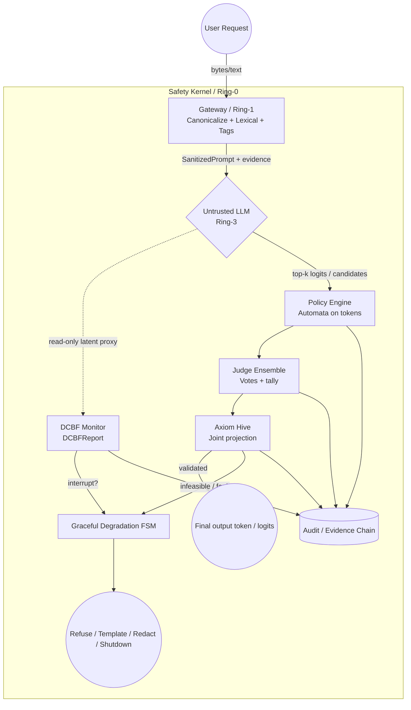

# RFC: Decoupled Safety Kernel Architecture (v0.2)

**Author:** Anthropic Claude Code  
**Supersedes:** `Decoupled Safety Kernel Architecture RFC_v0.1.md`（contract-first 修订版）  
**Incorporates:** `Decoupled Safety Kernel Architecture RFC_v0.2_review.md`（治理层与完整性补强）  
**Target audience:** 架构委员会、安全评审、内核/系统实现团队  
**Status:** Draft — 发布级整合稿

---

## 摘要（Abstract）

本 RFC 定义与基础大语言模型（LLM）**解耦**的 **Safety Kernel**：将基础模型视为 Ring-3 **非可信**用户态生成进程，在 Ring-0/1 以**可审计契约**强制执行输入净化、离散时间 DCBF 监测、DSL→自动机策略、多验证器裁决、候选集联合投影及 Graceful Degradation。规范要求每步生成在**有界时间**内完成，默认在冲突、不可行、超时或审计失败时走 **fail-safe**（以 deny/降级为主），并通过 **Audit / Evidence Chain** 绑定 `trace_id` 与规则/系数版本。

**非目标**不在摘要展开，见第 1 节；**威胁模型**见第 2 节；**全局安全不变量**见第 8 节；**故障分类**见第 9 节；**验证与配置**见第 11–13 节。

**关键词：** decoupled safety、control barrier function、runtime policy automaton、verifier ensemble、constraint projection、evidence chain、hard latency budget

---

## 规范性用语（RFC 2119）

文中 **必须（MUST）**、**不得（MUST NOT）**、**建议（SHOULD）**、**可选（MAY）** 的含义与 [RFC 2119](https://www.rfc-editor.org/rfc/rfc2119) 一致。

---

## 0. 设计目标与原则

本 RFC 定义与基础模型**解耦**的 **Safety Kernel**：基础 LLM 视为 **Ring-3 非可信、随机、用户态生成进程**；Safety Kernel 为 **特权态外生约束系统**，负责：

- 输入规范化、净化与边界隔离  
- 隐状态轨迹的**离散时间**安全监测（DCBF）  
- 安全规则 DSL 的解析、降级与确定性自动机执行  
- 多验证器的**可审计**裁决（非单一布尔）  
- 在安全可行域上对 **候选集 / 对数概率 / 能量** 的联合投影与故障处理  
- 安全与活性冲突时进入 **Graceful Degradation 状态机**

**核心原则：**

> Safety is an **external invariant** and an **auditable contract**, not an emergent property of the base model.

**失败默认（实现 MUST 遵守）：**

| 条件                 | 默认动作                               |
| ------------------ | ---------------------------------- |
| Verifier 冲突 / 证据不足 | **Deny**（拒绝或安全模板）                  |
| 投影不可行 / QP 超时      | **PageFault 路径** → 降级 FSM          |
| 步级总预算耗尽            | **DeadlineExceeded** → 降级 FSM      |
| 审计记录写入失败（若策略要求）    | **Fail-safe**（由部署策略定义；**建议** deny） |

---

## 1. 非目标（Non-Goals）

以下内容 **明确不在** 本 RFC 承诺范围内；实现者与评审 **不得** 将其误读为规范义务：

1. **不**证明或验证黑盒基础模型在**全输入空间**上“全局永远安全”（与全局隐式安全不可判定性结论一致）。  
2. **不**将自然语言 prompt 本身作为**唯一**运行时策略源；策略 MUST 经 DSL 解析/编译为可执行工件（自动机/检查器配置）。  
3. **不**声称所有语法/合规约束均可等价嵌入 **latent space**；latent 侧仅作用于**约定的只读代理**。  
4. **不**依赖**单一**大模型 Judge 作为**最终**仲裁；最终允许语义 MUST 来自 **Ensemble 协议 + 默认 deny**。  
5. **不**规定具体硬件（TEE、GPU 内核模式等）；与 TEE 的绑定为开放性工作。

---

## 2. 威胁模型（Threat Model）

### 2.1 攻击面分层

| 层      | 威胁示例                          | 主要缓解组件                                      |
| ------ | ----------------------------- | ------------------------------------------- |
| **输入** | 编码混淆、Unicode 规范化差异、边界污染、注入式指令 | Gateway（canonicalization + tags + findings） |
| **生成** | 潜轨迹逼近禁止方向、自回归放大有害模式           | DCBF Monitor、`DCBFReport`、投影收紧              |
| **输出** | 结构非法、多验证器冲突、投影不可行/超时          | Automata、`EnsembleReport`、Axiom Hive、降级 FSM |

### 2.2 对手能力假设

- 对手可控制**用户可见输入**（及部分上下文），**不得**假设**已突破** Ring-0 Safety Kernel 的完整性（若假设被违反，则退化为**主机沦陷**模型，超出本文档范围）。  
- 基础 LLM **可能**与对手输入对齐而产生有害 logits；Safety Kernel MUST 在**不信任**模型输出的前提下裁决。

### 2.3 安全目标（概要）

- **机密性/完整性**（对策略与审计日志）：策略加载与审计路径 MUST 具备部署定义的信任根。  
- **可用性**：在攻击下允许**降级**，但 MUST NOT 在 deny 策略下“静默放行”高危输出。

---

## 3. 架构拓扑：分层 + 权责 + 证据链

### 3.1 Ring 与信任边界

| 环          | 组件                                                                            | 典型权限                         |
| ---------- | ----------------------------------------------------------------------------- | ---------------------------- |
| **Ring-3** | Untrusted LLM（自回归核）                                                           | 仅用户态缓冲；**无**策略写权限            |
| **Ring-1** | Gateway（规范化 / 词法 / 边界）                                                        | 读请求；输出规范化流 + **policy_tags** |
| **Ring-0** | DCBF Monitor、Policy Engine、Judge Ensemble、Axiom Hive、Graceful Degradation FSM | 可中断生成步；可写**审计与裁决**           |
| **横切**     | **Audit Log / Evidence Chain**（强制）                                            | 只追加；与每次 token 步绑定 `trace_id` |

### 3.2 职责细化

- **Gateway**：区分 **canonicalization**、**lexical matching**、**boundary sanitization**、**policy tagging**。  
- **DCBF Monitor**：输入为 **latent 只读代理**；near-violation 时 **软收紧**或 **硬中断**（`DCBFReport.interrupt`）。  
- **Judge Ensemble**：**多 Verifier + 投票/计票**；禁止坍缩为单 `bool`。  
- **Axiom Hive**：对 **candidate set / logits / DCBF / ensemble / deadline** 联合决策。  
- **Graceful Degradation**：显式 **FSM**（Refuse / Template / Redact / Shutdown）。

### 3.3 架构图（Mermaid）



---

## 4. 约束三类分解（避免 latent/token 语义混杂）

1. **Lexical / structural（词法/结构）**  
   Gateway + DSL 编译产物在 **token 序列**上判定前缀合法性。

2. **Latent trajectory（潜轨迹）**  
   DCBF 仅在**约定的只读代理表示**上检查离散时间屏障；**不**声称全部语法约束可嵌入潜空间。

3. **Output legality / semantic contracts（输出合法性/语义契约）**  
   Judge Ensemble +（可选）外部确定性检查器；与 (1)(2) **正交**，结果 MUST 进入证据链。

---

## 5. 核心接口（厚契约 + 证据）

以下 Rust 风格接口为 **规范意图**；实现可拆分 crate，但**字段语义不得删减**（MUST NOT 弱化）。

### 5.1 Gateway

```rust
pub struct Finding {
    pub rule_id: String,
    pub span: std::ops::Range<usize>,
    pub severity: u8,
}

pub struct SanitizedPrompt {
    pub canonical: Vec<u8>,
    pub findings: Vec<Finding>,
    pub policy_tags: Vec<String>,
}

pub trait GatewayFilter {
    fn sanitize_input(&self, raw_input: &[u8]) -> Result<SanitizedPrompt, SystemFault>;
}
```

### 5.2 DCBF

```rust
pub struct DCBFReport {
    pub h_t: f32,
    pub h_t1: f32,
    pub margin: f32,
    pub near_violation: bool,
    pub interrupt: bool,
    pub barrier_id: Option<String>,
}

pub trait DCBFEvaluator {
    fn check_forward_invariance(
        &self,
        state_t: &LatentState,
        state_t1: &LatentState,
        alpha: f32,
    ) -> DCBFReport;
}
```

### 5.3 Safety DSL

```rust
pub trait SafetyDSLCompiler {
    fn parse(&self, dsl_rules: &str) -> Result<Ast, ParseError>;
    fn lower(&self, ast: &Ast) -> Result<DeterministicAutomaton, CompileError>;
    fn validate_prefix(
        &self,
        automata: &DeterministicAutomaton,
        prefix: &[Token],
        next: Token,
    ) -> Result<(), AutomatonReject>;
}
```

### 5.4 Judge Ensemble

```rust
pub struct Verdict {
    pub vote: bool,
    pub confidence: f32,
    pub explanation: String,
    pub verifier_id: String,
}

pub struct EnsembleReport {
    pub verdicts: Vec<Verdict>,
    pub tally_pass: u32,
    pub tally_fail: u32,
    pub conflict: bool,
    pub final_allow: bool,
}

pub trait JudgeEnsemble {
    fn verify(
        &self,
        candidate: &Token,
        ctx: &VerificationContext,
    ) -> EnsembleReport;
}
```

### 5.5 Axiom Hive

```rust
pub struct ProjectionInput<'a> {
    pub logits: &'a [f32],
    pub topk_indices: &'a [usize],
    pub automata: &'a DeterministicAutomaton,
    pub dcbf: &'a DCBFReport,
    pub ensemble: &'a EnsembleReport,
    pub deadline: std::time::Instant,
}

pub struct ProjectionOutput {
    pub chosen_index: usize,
    pub feasible: bool,
    pub energy: f32,
    pub distance: f32,
    pub page_fault: bool,
}

pub trait AxiomHiveBoundary {
    fn enforce_projection(&self, input: ProjectionInput<'_>) -> ProjectionOutput;
}
```

### 5.6 Graceful Degradation

```rust
pub enum DegradeAction {
    EmitSafeTemplate,
    Refuse,
    Redact,
    Shutdown,
}

pub trait GracefulDegradation {
    fn on_fault(&self, fault: SafetyFault) -> DegradeAction;
}
```

---

## 6. 控制主循环（top-k → 自动机 → 投票 → 投影 → 降级）

每步围绕 **安全候选集上的最小偏移选择**，而非单 token 事后补救。

### 6.1 主循环（伪代码）

```rust
const HARD_LATENCY_BUDGET: Duration = Duration::from_millis(20);
const QP_INNER_BUDGET: Duration = Duration::from_millis(5);

pub async fn generate_token_intercept(
    ctx: &mut ExecutionContext,
    kernel: &SafetyKernel,
) -> SafeToken {
    let result = timeout(HARD_LATENCY_BUDGET, async {
        let sanitized = kernel.gateway.sanitize_input(ctx.raw_user_bytes())?;

        let (latent_t, latent_t1) = ctx.untrusted_llm.peek_latent_trajectory().await;
        let dcbf = kernel.dcbf.check_forward_invariance(&latent_t, &latent_t1, 0.1);
        kernel.audit.append_step("dcbf", &dcbf);

        if dcbf.interrupt {
            return Err(SafetyFault::LatentSpaceViolation(dcbf));
        }

        let (logits, topk_idx) = ctx.untrusted_llm.topk_logits(&latent_t1, K).await;

        let mut legal: Vec<usize> = Vec::new();
        let mut ensemble_for_projection: Option<EnsembleReport> = None;
        for &i in topk_idx {
            let tok = ctx.untrusted_llm.index_to_token(i);
            if kernel
                .compiler
                .validate_prefix(&kernel.automata, ctx.prefix_tokens(), tok)
                .is_ok()
            {
                let ens = kernel.judge_ensemble.verify(&tok, &ctx.vctx);
                kernel.audit.append_step("ensemble", &ens);
                if ens.final_allow {
                    legal.push(i);
                    ensemble_for_projection = Some(ens);
                }
            }
        }

        let ensemble_ref = ensemble_for_projection
            .as_ref()
            .ok_or(SafetyFault::EvidenceMissing)?;

        let po = kernel.axiom_hive.enforce_projection(ProjectionInput {
            logits: &logits,
            topk_indices: &legal,
            automata: &kernel.automata,
            dcbf: &dcbf,
            ensemble: ensemble_ref,
            deadline: Instant::now() + QP_INNER_BUDGET,
        });

        if !po.feasible || po.page_fault {
            return Err(SafetyFault::UnrecoverablePageFault(po));
        }

        Ok(ctx.untrusted_llm.index_to_token(po.chosen_index))
    })
    .await;

    match result {
        Ok(Ok(tok)) => tok,
        Ok(Err(f)) => kernel.degradation.on_fault(f).into_token(),
        Err(_) => kernel
            .degradation
            .on_fault(SafetyFault::DeadlineExceeded)
            .into_token(),
    }
}
```

实现 MUST 将 `EnsembleReport` 聚合策略（如按 logit 选最优对应报告、worst-case 合并等）**写入审计**；上文“最后一个合法候选”仅为占位示例。

---

## 7. 数学映射（文本可审计）

### 7.1 记号

- $z \in \mathbb{R}^d$：潜空间**代理**向量；**不等同于**完整模型状态。  
- $C \subseteq \mathbb{R}^d$：潜空间可行域（若使用）；token 级合法性由**有限自动机**单独维护。

### 7.2 禁止区能量

$$
E_{\mathrm{forbid}}(z) =
\begin{cases}
0 & z \in C \\
\eta \cdot \phi\bigl(\mathrm{dist}(z,\partial C)\bigr) & z \notin C
\end{cases}
$$

$\eta$为大惩罚；$\phi$可为二次或 reciprocal wall；实现 MUST 配置 **residual 阈值**与**时间上限**。

### 7.3 总能量（工程语义）

$$
H(z) = E_{\mathrm{model}}(z) + E_{\mathrm{forbid}}(z)
$$

$E_{\mathrm{model}}$的版本与系数 MUST 进入审计（见第 10 节）。

### 7.4 投影

$$
z^\star = \arg\min_{z \in C} \; \|z - z_{\mathrm{cand}}\|_2^2 + \lambda \, E_{\mathrm{forbid}}(z)
$$

`ProjectionOutput` MUST 填充 `feasible`、`energy`、`distance`、`page_fault`。

### 7.5 DCBF

$$
h(x_{t+1}) \ge (1-\alpha)\, h(x_t), \quad \alpha \in (0,1]
$$

`DCBFReport.margin` 可实现为 $h(x_{t+1}) - (1-\alpha)h(x_t)$。

### 7.6 PageFault 触发（任一）

- 投影不可行；QP 超 `QP_INNER_BUDGET`；残差/KKT 超阈值；Ensemble 冲突且策略 deny。

---

## 8. 安全不变量（Safety Invariants）

以下不变量在**单请求、单 token 步**语义下 MUST 成立（除非进入已审计的 Shutdown 路径）：

1. **I1（裁决隔离）** 基础 LLM MUST NOT 直接写入 Safety Kernel 的持久裁决状态（策略版本、自动机、审计存储）；仅能通过**限定 API**（如 logits、latent 代理读）交互。  
2. **I2（输出必经安全链）** 任何对用户可见的 token/stream MUST 经过 Gateway →（DCBF 按部署启用）→ Policy/Automata → Ensemble →（Axiom Hive 按部署启用）→ 审计记录中的可追溯步骤。  
3. **I3（DCBF 与前向不变）** 当 `DCBFReport.interrupt == false` 且实现声明启用 DCBF 硬约束时，屏障条件 MUST 在该步上满足；`near_violation` MAY 触发收紧但 MUST NOT 静默跳过审计。  
4. **I4（冲突默认安全）** `EnsembleReport.conflict == true` 时，`final_allow` MUST 为 `false`，除非部署显式注册**更高危**的“break-glass”策略（该策略本身 MUST 被审计）。  
5. **I5（有界时间）** 单步拦截 MUST 在 `HARD_LATENCY_BUDGET` 内终止于**输出或降级**；不得无限阻塞等待 LLM。

---

## 9. 故障分类（Fault Taxonomy）

实现 SHOULD 将故障映射到以下类型，便于遥测与降级路由：

| 类型                | 含义              | 典型来源                              |
| ----------------- | --------------- | --------------------------------- |
| `GatewayFault`    | 规范化/编码/边界失败     | `sanitize_input`                  |
| `MonitorFault`    | DCBF 读代理或评估失败   | `DCBFEvaluator`、探针不可用             |
| `PolicyFault`     | DSL/自动机/前缀非法    | `parse`/`lower`/`validate_prefix` |
| `VerifierFault`   | 单验证器崩溃或超时       | Ensemble 成员                       |
| `ProjectionFault` | 不可行、QP 失败、超时    | Axiom Hive                        |
| `KernelFault`     | 审计失败、死锁、内部不变量破坏 | Audit、调度                          |

`SafetyFault` 可组合上述类型；降级 FSM MUST 能区分 **可恢复**（模板/重试）与 **不可恢复**（Shutdown）。

---

## 10. 延迟预算与调度规则（Latency Budget & Scheduling Rules）

### 10.1 建议分账（可配置，默认安全值由部署提供）

| 阶段                  | 建议上限（ms） | 说明                          |
| ------------------- | -------- | --------------------------- |
| Gateway / normalize | 2        | canonical + tags            |
| DCBF + latent read  | 4        | 含 `DCBFReport`              |
| top-k + automata    | 5        | 与 K 联动                      |
| Judge Ensemble      | 4        | 并行取临界路径                     |
| Axiom Hive（QP）      | 4        | ≤ `QP_INNER_BUDGET`（如 5 ms） |
| Audit append        | 1        | 失败策略见 0 节表                  |

### 10.2 调度 MUST

- 子预算之和 MUST NOT 超过 `HARD_LATENCY_BUDGET`（除非显式 **under-provision** 模式已注册且审计）。  
- 任一子阶段超时 MUST 映射为 `DeadlineExceeded` 并进入降级。  
- **建议**：为每层保留 **monotonic deadline**（子截止时间递减），避免“每层都差一点”整体爆炸。

---

## 11. 审计与证据链要求（Audit / Evidence Chain）

### 11.1 每条 token 步 MUST 记录（最小字段）

- `trace_id`：跨步一致  
- `step_index`  
- `policy_revision` / `dsl_hash` / `automaton_revision`  
- `coeff_revision`（\(\alpha,\lambda,\eta,\epsilon\) 等绑定版本）  
- `dcbf`：`DCBFReport` 序列化摘要  
- `ensemble`：`EnsembleReport` 摘要（含 `verdicts` 哈希或裁剪引用）  
- `projection`：`ProjectionOutput` 摘要  
- `degrade_action`（若发生）

### 11.2 MUST

- 审计日志 MUST **只追加**（append-only）；篡改检测由部署层负责。  
- 若策略要求“无审计则不放行”，审计写入失败 MUST 触发 0 节 fail-safe。

---

## 12. 测试与验证（Testing & Validation）

### 12.1 MUST 覆盖

- **单元测试**：`validate_prefix`、DCBF margin 计算、Ensemble tally、投影 feasible/fault 分支。  
- **属性测试**：前缀闭包安全下，非法扩展 MUST 被拒绝。  
- **回归测试**：固定 `trace_id` 重放，输出与审计一致。  
- **预算耗尽测试**：人为注入慢路径，MUST 命中 `DeadlineExceeded` 与预期降级。  
- **降级迁移测试**：`ProjectionFault` → Template → 后续步继续符合 I1–I5。

### 12.2 SHOULD

- 模糊测试 Gateway 规范化与畸形 UTF-8。  
- 对抗样本集针对 top-k 过滤与冲突策略。

---

## 13. 热更新、配置与版本（Hot Reload / Configuration / Versioning）

### 13.1 DSL / 策略热更新 MUST

- 新 DSL MUST 完整经过 `parse` → **lint/normalize（建议）** → `lower`；**任一步失败则不得**替换在线 `DeterministicAutomaton`。  
- 切换原子：建议 **double-buffer**（激活指针仅在成功编译后翻转）；旧版本保留至 inflight 请求结束或 TTL。  
- `policy_revision`、`dsl_hash`、`automaton_revision` MUST 写入审计。

### 13.2 配置项 SHOULD 可运行时调整（带默认安全值）

- `HARD_LATENCY_BUDGET`、各子切片、`QP_INNER_BUDGET`、\(K\)、\(\alpha,\lambda,\eta,\epsilon\)。  
- 配置变更 MUST 产生审计事件（谁、何时、旧值、新值）。

### 13.3 MUST NOT

- 热更新路径 MUST NOT 跳过解析直接加载二进制自动机（除非该二进制已由可信管道签名且版本已审计）。

---

## 14. 向后兼容（Backward Compatibility）

- **v0.2** 相对 **v0.1（修订版）**：新增摘要、非目标、威胁模型、不变量、故障分类、审计字段、测试与热更新章节；**接口语义与 v0.1 修订版一致**，未删除既有字段。  
- 后续 **v0.3** 若删减 `ProjectionInput` 字段或改变默认 deny 语义，MUST 提供迁移说明与兼容标志。  
- 建议：对外暴露 `kernel_abi_version` 与 `policy_schema_version`。

---

## 15. 与前期文档的关系

| 文档                         | 关系                           |
| -------------------------- | ---------------------------- |
| 最早 v0.1 概念稿（`RFC_v0,1.md`） | 已由 contract-first v0.1 修订版取代 |
| `RFC_v0.1.md`（修订版）         | 本 v0.2 **继承其全部技术主干**         |
| `RFC_v0.2_review.md`       | 本 v0.2 **吸收其治理层与目录补强**       |

### 15.1 v0.2 相对 v0.1（修订版）新增摘要

- Abstract、RFC 2119、Non-Goals、Threat Model  
- Safety Invariants、Fault Taxonomy  
- Latency 调度 MUST、Audit 最小字段  
- Testing & Validation、Hot Reload / Versioning、Backward Compatibility  

---

## 16. 开放性工作

- `LatentState` 与 probe 的对抗鲁棒性与因果性评估。  
- \(K,$\alpha$,$\lambda$,$\eta$\) 自适应与在线调参的安全边界。  
- 硬件 TEE / 内核调度器协同。  
- Formal methods 对自动机与屏障条件的机器可查证明（可选）。

---

## 结论

Decoupled Safety Kernel v0.2 在 v0.1 **契约化主干**之上，补齐**可评审 RFC**所需的治理与验证章节：非目标与威胁模型界定范围，不变量与故障分类统一实现与运维语言，审计与预算规则使 fail-safe **可执行**，测试与热更新条款使规范**可落地**。实现应 **以本文件为单一权威**（SSOT）进行对齐与评审。

---

**文档结束。**
