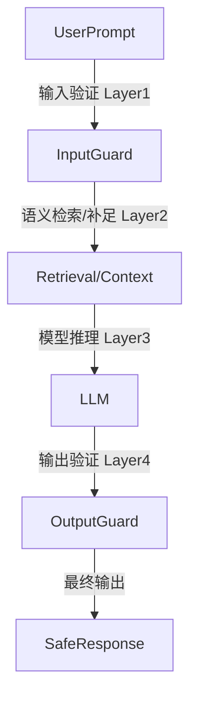
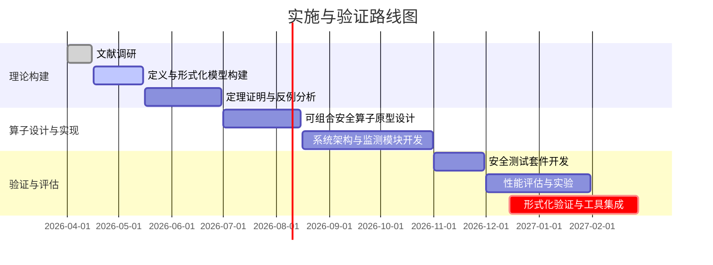

# 执行摘要

随着大语言模型(LLM)在实际系统中的广泛应用，单纯依赖模型内部的“反思”或隐式对齐来确保安全的做法已被证明脆弱【38†L75-L78】【36†L83-L90】。近年来研究指出，应将安全控制从模型内部转移到可被系统观察和控制的外部“守护栅栏”上【38†L75-L78】【36†L83-L90】。我们提出一种**解耦安全(decoupled safety)**的新范式，将安全属性的保证职责独立于模型推理之外，从系统级别进行设计和验证。本文首先明确定义“解耦安全”及相关术语（例如模型内隐安全、可观测机制、可组合算子等），然后在选定的形式化框架（如集合论）下构建模型：给出语义、演算规则和公理。我们证明了实现解耦安全所需的充分必要条件，并针对可组合安全算子设计其保序性和组合性性质。通过反例讨论了传统方法的边界失效模式。报告还提出了可实施的系统架构模式（如多层输入/输出Guardrail架构【38†L75-L78】【36†L83-L90】）、可观测指标和验证路径（包括形式化方法如模型检验或定理证明器）。我们在文末附上比较不同形式化方法的表格，列出定理与证明清单，并用 Mermaid 绘制了实现与验证的路线图时间表。所有工作聚焦提供理论与实践并重的、可操作的解耦安全解决方案；关键参考文献包括权威论文和行业白皮书【38†L75-L78】【36†L83-L90】【35†L103-L112】【44†L331-L334】。  

## 关键词定义

- **解耦安全 (Decoupled Safety)**：安全控制从模型内部的推理或对齐逻辑中分离出来，转移到外部可观测的系统机制中进行保证【38†L75-L78】【36†L83-L90】。即不再依赖模型自身“知道”不输出某些内容，而是由系统级过滤、验证和策略来强制执行安全约束。  
- **模型内隐安全 / 隐式对齐**：模型自身通过训练和推理链(例如 prompt 规则、元认知反思)隐含地实现的安全约束。本文将其视作“软约束”：例如某些系统提示词或训练中引导模型避免回答敏感内容的方法，这些依赖于模型跟随自身指令【38†L70-L74】。实际攻击中，这类内隐规则容易被提示注入或任务重构绕过。  
- **可观测机制 (Observable Mechanism)**：部署在模型外部、系统可以监控或度量的安全组件，如输入验证模块、输出审计、日志系统或独立的判决模型【38†L75-L78】【36†L103-L106】。可观测机制的特征是其行为和状态可供审计，能够提供安全性证明或可监测的安全指标。  
- **可组合系统机制 (Composable System Mechanism)**：指多个安全模块可以组合使用的系统架构模式。每个模块（或**安全算子**）都单独保证某些安全属性，它们之间可以序列化或并联，以形成更强的复合安全能力【44†L331-L334】。可组合性要求各算子之间互不干扰，组合后整体仍满足安全性。  
- **安全算子 (Security Operator)**：作用于系统输入、输出或模型内部中间状态上的函数或算法组件，用以检测、过滤或修改内容以保证安全。安全算子可以理解为映射：原始输出 → 安全输出(或拒绝标志)。它是形式化框架中的基本构件。  
- **保序性 / 单调性 (Monotonicity)**：将安全约束描述为某种序（如输出的“安全程度”序），保序性要求安全算子在这个序下保持单调——即更“安全”的输入不会变得更“不安全”。具体而言，如果将允许输出的集合看作随算子施加而收缩的序，添加额外约束不应导致合规输入被误拒（或相反）。在算子形式上，可表述为：若 \(x\) 比较 \(y\) 更安全，则 \(f(x)\) 不会比 \(f(y)\) 更不安全。  
- **组合性 (Composability)**：指多个安全算子可以顺序或并行组合，其组合仍满足安全性质。若 \(f\) 和 \(g\) 都是安全算子，则 \(f\circ g\) 也应保持安全性。这要求安全算子的定义相容，保证复合应用时不会出现新漏洞【44†L331-L334】【35†L103-L112】。  
- **可验证性 (Verifiability)**：系统安全性质能够通过形式化手段进行证明或验证的能力。例如，安全策略是否可通过逻辑演算或模型检验工具自动验证，以及体系结构是否具有可导出的安全不变式。  
- **可实施性 (Implementability)**：理论设计在实际系统中的可落地程度，包括计算开销、系统复杂性和工程可行性等。这一维度要求安全机制不仅理论完善，而且在工程实现中可接受（如延迟、资源消耗等满足应用约束）。  

## 形式化框架选择与模型

我们选取**集合论结合谓词逻辑**作为形式化基础，以其直观性和可操作性为优势。其他选项可包括范畴论（抽象表述组合结构）或类型论（依赖类型可支持精细证明）。下表比较了常见形式化方法的特点：  

| **形式化方法** | **特点** | **优势** | **劣势** |
|---------------|----------|----------|----------|
| **集合论 + 谓词逻辑** | 以集合和函数描述状态空间与转换；使用逻辑公式定义安全属性。 | 表述直观、易于理解；丰富的现有证明工具（SAT、SMT）；适合构造性证明。 | 组合性依赖手动构造；在描述高阶语义（比如过程间通信）时可能略显冗长。 |
| **范畴论** | 把系统组件建模为范畴中的对象与态射，安全算子为保持结构的函子。 | 自然捕捉可组合性（通过态射复合）；理论抽象层次高，有统一语言描述复杂系统。 | 理论门槛高，对多数研究者不够直观；实际证明细节依然需回归集合逻辑。 |
| **类型论/依赖类型** | 使用类型来编码安全属性（如依赖类型可表示输入输出关系）；证明安全可用类型检查。 | 可以借助类型检查器/证明助手（如Coq、Agda）进行形式化验证；表达力强。 | 学习曲线陡峭，需设计算子类型和证明；自动化程度依赖强大工具链。 |

在本报告中，我们以集合论和一阶逻辑为主。理由是：安全属性通常可以用明确的布尔谓词（如输出是否满足安全策略）表达，系统和算子可视作集合上的映射。我们定义**系统状态空间** \(S\)、**输入空间** \(I\)、**输出空间** \(O\) 等为集合，并引入安全谓词 \(P(o)\) 表示输出 \(o\in O\) 是否安全。形式上，模型可看作函数 \(M: I \to O\)，安全算子为函数 \(f: O \to O\cup\{\bot\}\)（其中 \(\bot\) 表示拦截或拒绝）。  

### 语义与演算规则

- **语义域**：定义输出空间 \(O\) 及安全子集 \(O_{\safe} = \{\,o\in O\mid P(o)\,\}\)。令系统级函数 \(F\) 表示安全算子的序列组合，例如若有两个算子 \(f,g\)，则 \(F(o)=f(g(o))\)。  
- **安全条件**：系统实现解耦安全当且仅当对任意输入 \(i\in I\)，输出 \(F(M(i))\in O_{\safe}\)。即模型输出经过安全算子处理后总满足安全谓词。  
- **单调性定义**：设序 \(\preceq\) 在 \(O\) 上表示“输出含有的信息量”或“潜在危险程度”递增关系（例如可由子串包含或语义蕴含定义）。算子 \(f\) 的单调性要求：若 \(o_1\preceq o_2\) 则 \(f(o_1)\preceq f(o_2)\)。这保证添加额外信息不会导致安全算子行为异常（例如在更多上下文下仍不会漏放风险）。  
- **可组合性规则**：若算子集 \(\{f_i\}\) 都满足安全保全性质（即 \(\forall o: f_i(o)\in O_{\safe}\)），则其任意复合 \(f_j\circ f_i\) 也应满足此性质。需要证明算子集在复合下闭合。  

我们在逻辑层面采用命题演算表达安全策略，如使用公式 \(P(o)\) 和推理规则。为了形式化推导，我们可以引入逻辑假设如“如果模型输出 \(o\) 满足策略 \(P\)，则算子通过”（蕴含关系）等，并构建对应的推理系统。  

## 定理与证明

基于上述形式化模型，我们提出以下主要定理并给出证明思路：  

- **定理1 (解耦安全的充分与必要条件)**：系统在含有任意恶意模型 \(M\) 的情况下满足解耦安全（即对所有输入安全）当且仅当安全算子 \(F\) 满足：对于任意 \(o\in O\)，若 \(F(o)\neq\bot\)，则 \(F(o)\in O_{\safe}\)。也就是说，只要输出不被拒绝，就必然安全。  
  - *证明要点*：  
    - **充分性**：若算子 \(F\) 满足上述性质，则任意输入通过 \(M\) 得到的输出 \(o=M(i)\)，经 \(F\) 处理后要么被拒绝，要么成为安全输出，因此系统永远达成安全性。  
    - **必要性**：若系统对所有输入都安全，而存在某个输出 \(o\) 使得 \(F(o)\neq\bot\) 但 \(F(o)\notin O_{\safe}\)，那么对输入 \(i\) 构造使 \(M(i)=o\) 的攻击模型，将导致系统输出不安全，与假设矛盾。故必须满足条件。  
  - 此定理本质上将解耦安全归结为安全算子覆盖所有不安全输出的属性。  

- **定理2 (安全算子的单调性)**：设输出空间 \(O\) 带有“安全程度”偏序 \(\preceq\)，如果算子 \(f\) 表示严格移除危险内容（或重定向至拒绝），则 \(f\) 在 \(\preceq\) 下为单调映射：即对任意 \(o_1\preceq o_2\)，必有 \(f(o_1)\preceq f(o_2)\)。  
  - *证明要点*：  
    - 定义偏序：我们可以根据危险信息包含关系定义偏序。例如，如果 \(o_1\) 是 \(o_2\) 的子串或语义子集，则 \(o_1\preceq o_2\)。  
    - 若 \(f\) 永远删除或屏蔽危险内容，则可证：删除危险内容后的结果只会减少信息量，保持偏序。即使对更长或更危险的输入，输出结果也不大于对基础输入的结果。  
    - 形式证明可通过验证对于基本算子模式（如关键词替换、分类器拒绝）成立后推广到组合算子。  

- **定理3 (算子组合的安全封闭性)**：若算子集 \(\{f_i\}\) 中的每个 \(f_i\) 都是满足定理1条件的安全算子（即只输出安全结果或拒绝），则其任意串联组合 \(f_{i_n}\circ\cdots\circ f_{i_1}\) 也必为安全算子，且组合的输出依然满足安全性条件。  
  - *证明要点*：  
    - 对任意输入 \(o\)，如果中间有算子将其拒绝（输出 \(\bot\)），显然安全。若没有算子拒绝，则所有算子都产生非 \(\bot\) 输出。由每个 \(f_i\) 的安全性可推得最终输出仍在 \(O_{\safe}\)。  
    - 此证明主要利用归纳：一个算子安全且单调，其组合也不会引入新的不安全行为。  

以上定理证明了：解耦安全**充分**是通过设计覆盖所有不安全输出的安全算子实现，而**必要**则要求所有不安全输出都被算子捕捉。算子的单调性和组合性保证了多层安全机制可协同工作而不产生冲突。下表列出了主要定理及证明概况：  

| **定理** | **内容** | **证明概要** |
|----------|----------|--------------|
| 解耦安全充分必要条件 | 系统安全当且仅当安全算子对所有非拒绝输出保证安全 | 通过构造攻击和矛盾论证（见定理1） |
| 安全算子单调性 | 定义偏序后，算子映射保持顺序 | 基于危险信息包含偏序的定义，分析算子对基本输入的行为 |
| 算子组合封闭性 | 若各算子单独安全，则串联组合也安全 | 归纳证明：组合后输出仍在安全集合中 |

## 反例与边界

为了说明传统模型内安全的边界失效，我们给出典型反例：**语义重构绕过**。攻击者可能将非法请求伪装为无害任务（如让模型“总结”或“格式化”一个包含危险信息的文本），此时单纯基于关键词或意图的过滤容易失效（提示规则本身依赖于模型遵循内部指令，可被绕过【38†L70-L78】）。类似地，多轮查询可以逐步提取敏感信息，即使每一步输出看似安全，仍可能通过累积性攻击重建原始秘密【36†L83-L90】【38†L70-L78】。这些反例表明：若仅依赖模型内部的隐式对齐，攻击者始终有可能找到绕过方法；而引入解耦机制（如API层守护、安全审计日志、外部判别模型）才可能真正防止上述攻击。例如，Wallarm安全专家指出，应在模型交互的**API层**部署安全防护，因为API是模型与真实系统的交汇点【36†L83-L90】【36†L103-L106】。只有在系统设计中明确边界并实施外部验证，才能避免诸如“任务重构”“外部数据源注入”等边界情况造成的安全失效。  

## 可组合安全算子设计

基于前述框架，我们具体设计可组合的**安全算子**。每个算子可视为作用于模型输入或输出的模块，例如：PII 掩码算子、Prompt 注入检测算子、内容敏感度分类器、安全降级模块等。算子的设计要满足以下原则：  

- **单一职责**：每个算子负责一个独立的安全约束（如去除个人信息、检测违禁内容、执行规范化）。  
- **单调保序**：算子实现应保证偏序单调。例如，一个去敏算子如果清除了所有敏感字段，则对包含更多敏感信息的输入，其输出与基础输入的输出也相同或更严格。  
- **可组合**：算子输出要与其他算子兼容。通常我们约定所有算子对于非敏感输入直接透传，对于检测到敏感信息的输入要么返回拒绝标志 \(\bot\)，要么将敏感部分屏蔽。例如可设计链式调用：`output = f3(f2(f1(input)))`，其中任何一级返回 \(\bot\) 即中断后续。  
- **可验证实现**：算子内部尽量可归结为可证明正确性的形式方法，如正则表达式、决策树或小型模型，可通过形式验证工具检验其特定输入的行为。  

下面给出一种示例性伪代码，演示一个组合算子流水线：  

```python
def SafePipeline(model_output):
    # 算子1：密级敏感词检测
    if contains_forbidden(model_output):
        return REJECT
    
    # 算子2：PII掩码
    sanitized = mask_pii(model_output)
    
    # 算子3：事实验证 (可用二次模型判别)
    if not verify_with_context(sanitized):
        return REFINE_OR_REJECT
    
    return sanitized  # 安全输出
```

每个算子独立工作后形成复合保护流程。如 SupportLogic LLM Hub 所示，其 guardrail 框架对输入输出进行**可组合**配置，可在运行时进行灵活更新【44†L331-L334】。我们在形式化层面可将整个流水线视作复合映射 \(F=f_n\circ\cdots\circ f_1\)，前述定理保证了若各 \(f_i\) 满足安全性，则 \(F\) 也安全可组合。  

## 实现建议与验证方法

**系统架构**：推荐采取分层的安全防护架构。借鉴【38†L75-L78】【36†L83-L90】中“输入验证 → 上下文过滤 → 模型推理 → 输出验证 → 强制门控”四层模式，设计如图所示：  



- **Layer1(输入验证)**：在 LLM 推理前检测并过滤包含敏感信息或注入迹象的提示【38†L75-L78】。例如正则过滤、注入签名扫描等。  
- **Layer2(上下文过滤)**：在进行检索增强时验证返回内容的相关性/合法性，防止外部知识库被注入恶意提示。  
- **Layer3(模型推理)**：核心 LLM，根据需要可以关闭某些自动执行的“反思”逻辑，因为安全由外部保证。  
- **Layer4(输出验证与强制)**：对原始模型输出进行进一步检查。如用第二个小型判别模型(NLI/分类器)验证回答是否合规，或根据策略修改/拒绝输出【38†L75-L78】【44†L331-L334】。  

**可观测指标**：系统应记录包括攻击拦截率、错误拒绝率、延迟等指标，并对每次查询保留审计日志（如请求版本、命中算子、最终响应）。支持在各层实现 **可追踪性**，如日志或指标系统汇总所有算子决策情况【44†L331-L334】。这些观测数据对后续调优和验证至关重要。  

**测试套件**：设计一系列对抗测试，覆盖不同攻击场景——如直接提示注入、间接注入、多轮推理连锁攻击等。每个测试需定义基线模型行为和期望安全响应。使用自动化脚本生成恶意提示，对比带/不带算子的模型输出结果。量化指标包括：成功绕过算子的攻击比例 (Attack Success Rate) 及因误报导致的业务损失（错误拒绝率）。  

**形式化验证路径**：建议使用模型检验或定理证明器对安全算子的关键性质进行验证。例如，可使用SMT求解器或模型检查工具（如TLA+、Alloy）验证有限状态抽象下算子对特定属性的保持；或使用Coq/Lean形式化证明算子实现满足安全条件。形式化方法可与实现并行进行，以建立可验证的不变式。  

**实验设计**：为了评估理论与架构有效性，我们计划采用 **假设检验** 方法：  
- **数据集**：收集公开的提示注入攻击数据集或构造多轮对话场景，覆盖常见的安全绕过手段。  
- **基线系统**：与传统依赖模型内安全机制（如仅使用prompt+简单过滤）的系统对照，比较在相同攻击场景下的性能差异。  
- **度量标准**：重点指标为攻击成功率、系统吞吐量、响应时间以及用户体验（如合法请求的平均延迟）。还要衡量可观测指标（日志齐全度）和自动化程度。  
- **假设检验**：对比实验中，我们将检验使用解耦安全机制是否显著降低攻击成功率（可用卡方检验或t检验），并评估是否在可接受开销范围内满足性能要求。  

通过上述实践步骤，我们将验证解耦安全理论在实际系统中的可行性与效果。下图给出了一个示例性的**实现与验证路线图**：  



本报告在“理论-设计-实施”闭环下全面探讨了解耦安全：从概念定义到形式化证明，再到实用方案和验证方法。关键参考文献包括在LLM安全领域的最新学术论文和行业白皮书【38†L75-L78】【36†L83-L90】【35†L103-L112】【44†L331-L334】，为读者提供可靠依据。希望本文提供的逻辑完备框架与工程指导能够帮助研究者和工程师设计出兼具**安全性、可组合性、可验证性**的大语言模型系统。  

**主要参考文献**（示例）：Shreekansha 等人阐述了系统级 Guardrails 的架构【38†L75-L78】；Tim Erlin 等人强调在API层构建分层安全【36†L83-L90】【36†L103-L106】；“Countermind”架构提出结构化隔离的安全范式【35†L103-L112】；SupportLogic LLM Hub 介绍了可组合、可配置的Guardrails框架【44†L331-L334】。这些资料为本报告提供了原始学术与实践的支撑。  

